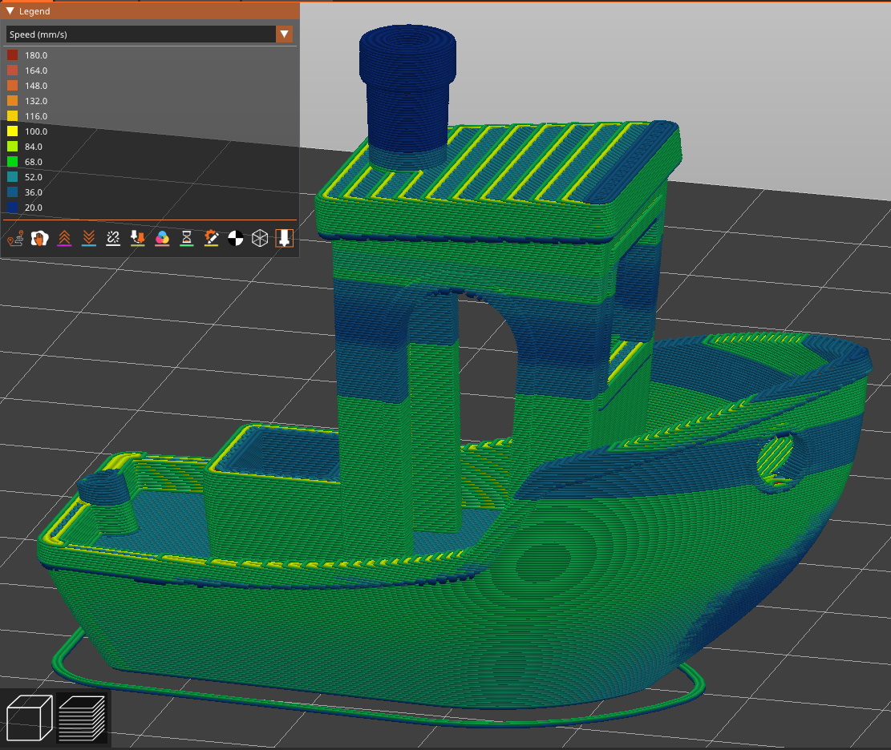
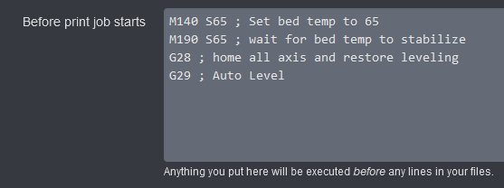
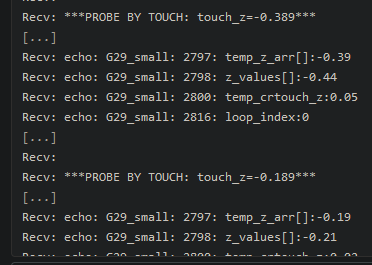

[](https://github.com/suchmememanyskill/PrusaSlicer-Ender3-v3-SE-Config/releases) [](https://ko-fi.com/suchmememanyskill)

# PrusaSlicer-Ender3-v3-SE-Config
An attempt at making a PrusaSlicer Profile for the Ender 3 v3 SE. This is supposed to be as close as a direct port of Creality's profile in Creality Print.

Feel free to contribute! If you have any questions, suggestions or improvements, feel free to reach out on [the Github discussions tab](https://github.com/suchmememanyskill/PrusaSlicer-Ender3-v3-SE-Config/discussions) or [Discord](https://discord.com/users/249186838592487425)

*Output of this PrusaSlicer profile*


*Output of official Creality Print profile*


## Current Issues
- Bridging seems imperfect. Need to play around more with how bridging works
- 90 degree corners on the xy axis become thick rounded corners. This is very bad for accuracy
- Stringing is a big issue

## Install Instructions
0. Make sure to have PrusaSlicer installed, opened at least once and followed the initial setup guide
1. Go to the [Releases](https://github.com/suchmememanyskill/PrusaSlicer-Ender3-v3-SE-Config/releases) page
2. Download the file `Source code (zip)` from the latest release
3. Open up windows search and type in `%APPDATA%`, then press enter
4. Enter the `PrusaSlicer` folder in the newly opened explorer window
5. Open the Source Code .zip file, navigate into `PrusaSlicer-Ender3-v3-SE-Config-main`, then into `PrusaSlicer`
6. Copy everything in the .zip's `PrusaSlicer` folder to the `PrusaSlicer` folder in AppData 
    - Replace files when asked

# Misc
This section contains other discoveries and curiosities i have found on the V3 SE

## OctoPrint calibrate before print
To auto calibrate before each print, place the following GCODE at `Settings` > `Printer` > `GCODE Scripts` > `Before print job starts` in OctoPrint:
```
M140 S65 ; Set bed temp to 65
M190 S65 ; wait for bed temp to stabilize
G28 ; home all axis and restore leveling
G29 ; Auto Level
```



This implementation is not the same as the 'Calibrate' button toggled on the screen before an sd print. G29 just performs the standard 4x4 probe test, not the shortend 4 corner probe test. Internally this seems to be called G29_small. I do not know how to run G29_small from gcode.


